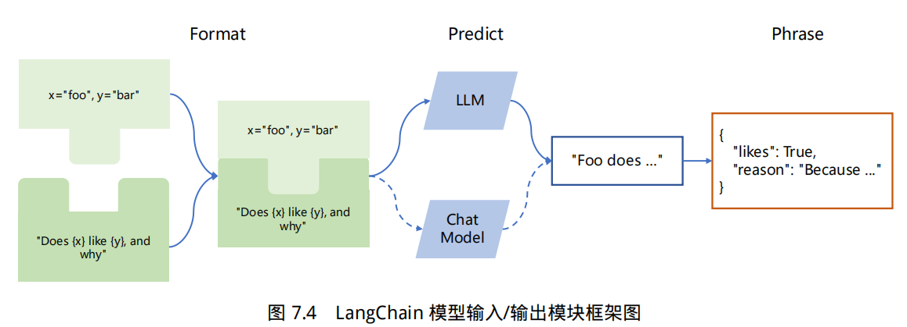
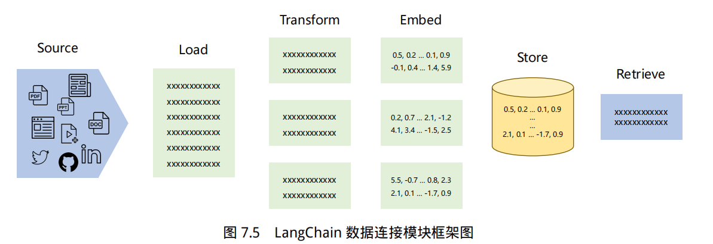
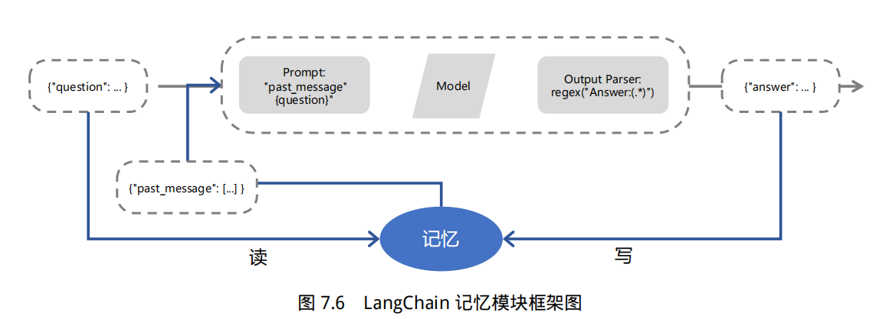
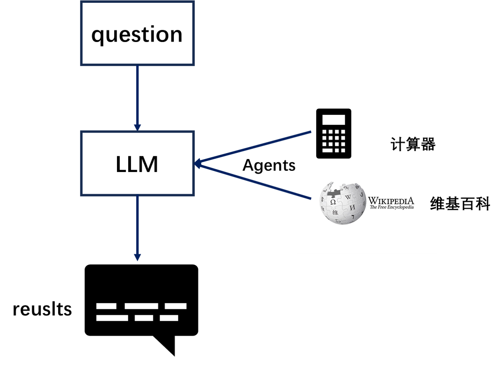

# 七、langchain 核心组件详解

## 1. 模型输入/输出

LangChain 中模型输入/输出模块是与各种大语言模型进行交互的基本组件，是大语言模型应用的核心元素。**模型 I/O 允许您管理 prompt（提示），通过通用接口调用语言模型以及从模型输出中提取信息**。该模块的基本流程如下图所示。



主要包含以下部分：`Prompts`、`Language Models`以及 `Output Parsers`。**用户原始输入与模型和示例进行组合，然后输入给大语言模型，再根据大语言模型的返回结果进行输出或者结构化处理**。

## 2. 数据连接

大语言模型(Large Language Model, LLM), 比如 ChatGPT , 可以回答许多不同的问题。**但是大语言模型的知识来源于其训练数据集，并没有用户的信息（比如用户的个人数据，公司的自有数据），也没有最新发生时事的信息（在大模型数据训练后发表的文章或者新闻）**。因此大模型能给出的答案比较受限。如果能够让大模型在训练数据集的基础上，利用我们自有数据中的信息来回答我们的问题，那便能够得到更有用的答案。

为了支持上述应用的构建，LangChain 数据连接（Data connection）模块通过以下方式提供组件来**加载、转换、存储和查询数据**：`Document loaders`、`Document transformers`、`Text embedding models`、`Vector stores` 以及 `Retrievers`。数据连接模块部分的基本框架如下图所示。



## 3. 链（Chain）

虽然独立使用大型语言模型能够应对一些简单任务，但**对于更加复杂的需求，可能需要将多个大型语言模型进行链式组合，或与其他组件进行链式调用**。链允许将多个组件组合在一起，创建一个单一的、连贯的应用程序。例如，可以创建一个链，接受用户输入，使用 PromptTemplate 对其进行格式化，然后将格式化后的提示词传递给大语言模型。也可以通过将多个链组合在一起或将链与其他组件组合来构建更复杂的链。

大语言模型链（LLMChain）是一个简单但非常强大的链，也是后面我们将要介绍的许多链的基础。我们以它为例，进行介绍：

```python
import warnings
warnings.filterwarnings('ignore')

from langchain.chat_models import ChatOpenAI 
from langchain.prompts import ChatPromptTemplate  
from langchain.chains import LLMChain  

# 这里我们将参数temperature设置为0.0，从而减少生成答案的随机性。
# 如果你想要每次得到不一样的有新意的答案，可以尝试调整该参数。
llm = ChatOpenAI(temperature=0.0)  

#初始化提示模版
prompt = ChatPromptTemplate.from_template("描述制造{product}的一个公司的最佳名称是什么?")

#将大语言模型(LLM)和提示（Prompt）组合成链
chain = LLMChain(llm=llm, prompt=prompt)

#运行大语言模型链
product = "大号床单套装"
chain.run(product)
```
运行输出：
>'"豪华床纺"'

除了上例中给出的 LLMChain，LangChain 中链还包含 RouterChain、SimpleSequentialChain、SequentialChain、TransformChain 等。

- `RouterChain` 可以**根据输入数据的某些属性/特征值，选择调用不同的子链**（Subchain）。
- `SimpleSequentialChain` 是最简单的序列链形式，其中每个步骤具有单一的输入/输出，**上一个步骤的输出是下一个步骤的输入**。
- `SequentialChain` 是简单顺序链的更复杂形式，允许**多个输入/输出**。
- `TransformChain` 可以引入**自定义转换函数，对输入进行处理后进行输出**。

以下是使用 SimpleSequentialChain 的代码示例：

```python
from langchain.chains import SimpleSequentialChain
llm = ChatOpenAI(temperature=0.9)

#创建两个子链

# 提示模板 1 ：这个提示将接受产品并返回最佳名称来描述该公司
first_prompt = ChatPromptTemplate.from_template(   
    "描述制造{product}的一个公司的最好的名称是什么"
)
chain_one = LLMChain(llm=llm, prompt=first_prompt)

# 提示模板 2 ：接受公司名称，然后输出该公司的长为20个单词的描述
second_prompt = ChatPromptTemplate.from_template(   
    "写一个20字的描述对于下面这个\
    公司：{company_name}的"
)
chain_two = LLMChain(llm=llm, prompt=second_prompt)

#构建简单顺序链
#现在我们可以组合两个LLMChain，以便我们可以在一个步骤中创建公司名称和描述
overall_simple_chain = SimpleSequentialChain(chains=[chain_one, chain_two], verbose=True)


#运行简单顺序链
product = "大号床单套装"
overall_simple_chain.run(product)
```
运行输出：


    > Entering new SimpleSequentialChain chain...
    优床制造公司
    优床制造公司是一家专注于生产高品质床具的公司。
    
    > Finished chain.


    '优床制造公司是一家专注于生产高品质床具的公司。'


## 4. 记忆（Memory）

在 LangChain 中，记忆（Memory）指的是大语言模型（LLM）的短期记忆。为什么是短期记忆？那是因为LLM训练好之后 (获得了一些长期记忆)，它的参数便不会因为用户的输入而发生改变。当用户与训练好的LLM进行对话时，LLM 会暂时记住用户的输入和它已经生成的输出，以便预测之后的输出，而模型输出完毕后，它便会“遗忘”之前用户的输入和它的输出。因此，之前的这些信息只能称作为 LLM 的短期记忆。

正如上面所说，在与语言模型交互时，你可能已经注意到一个关键问题：它们并不记忆你之前的交流内容，这在我们构建一些应用程序（如聊天机器人）的时候，带来了很大的挑战，使得对话似乎缺乏真正的连续性。因此，在本节中我们将介绍 LangChain 中的记忆模块，即如何将先前的对话嵌入到语言模型中的，使其具有连续对话的能力。



## 5. 代理（Agents）

**大型语言模型（LLMs）非常强大，但它们缺乏“最笨”的计算机程序可以轻松处理的特定能力**。LLM 对逻辑推理、计算和检索外部信息的能力较弱，这与最简单的计算机程序形成对比。例如，语言模型无法准确回答简单的计算问题，还有当询问最近发生的事件时，其回答也可能过时或错误，因为无法主动获取最新信息。这是由于当前语言模型仅依赖预训练数据，与外界“断开”。要克服这一缺陷， LangChain 框架提出了 “代理”( Agent ) 的解决方案。**代理作为语言模型的外部模块，可提供计算、逻辑、检索等功能的支持，使语言模型获得异常强大的推理和获取信息的超能力**。



## 6.回调（Callback）

LangChain提供了一个**回调系统，允许您连接到LLM应用程序的各个阶段。这对于日志记录、监视、流式处理和其他任务非常有用**。

**Callback 模块扮演着记录整个流程运行情况的角色，充当类似于日志的功能。在每个关键节点，它记录了相应的信息，以便跟踪整个应用的运行情况**。例如，在 Agent 模块中，它记录了调用 Tool 的次数以及每次调用的返回参数值。Callback 模块可以将收集到的信息直接输出到控制台，也可以输出到文件，甚至可以传输到第三方应用程序，就像一个独立的日志管理系统一样。通过这些日志，可以分析应用的运行情况，统计异常率，并识别运行中的瓶颈模块以进行优化。

Callback 模块的具体实现包括两个主要功能，对应`CallbackHandler` 和 `CallbackManager` 的基类功能：

- CallbackHandler 用于记录**每个应用场景（如  Agent、LLchain 或 Tool ）的日志**，它是单个日志处理器，主要记录单个场景的完整日志信息。
- 而CallbackManager则**封装和管理所有的 CallbackHandler** ，包括单个场景的处理器，也包括整个运行时链路的处理器。"

#### 在哪里传入回调 ?

该参数可用于整个 API 中的大多数对象（链、模型、工具、代理等），位于两个不同位置：：

`构造函数回调`：在构造函数中定义，例如 LLMChain(callbacks=[handler], tags=['a-tag']) ，它将被用于对该对象的所有调用，并且将只针对该对象，例如，如果你向 LLMChain 构造函数传递一个 handler ，它将不会被附属于该链的 Model 使用。

`请求回调`：定义在用于发出请求的 call() / run() / apply() 方法中，例如 chain.call(inputs, callbacks=[handler]) ，它将仅用于该特定请求，以及它包含的所有子请求（例如，对 LLMChain 的调用会触发对 Model 的调用，该 Model 使用 call() 方法中传递的相同 handler）。

verbose 参数在整个 API 的大多数对象（链、模型、工具、代理等）上都可以作为构造参数使用，例如 LLMChain(verbose=True)，它相当于将 ConsoleCallbackHandler 传递给该对象和所有子对象的 callbacks 参数。这对调试很有用，因为它将把所有事件记录到控制台。

#### 你想在什么时候使用这些东西呢？

**构造函数回调对诸如日志、监控等用例最有用，这些用例不是针对单个请求，而是针对整个链**。例如，如果你想记录所有向 LLMChain 发出的请求，你可以向构造函数传递一个处理程序。

**请求回调对流媒体等用例最有用**，你想把单个请求的输出流向特定的 websocket 连接，或其他类似用例。例如，如果你想把单个请求的输出流到一个 websocket ，你会把一个处理程序传递给 call() 方法.

> 关于langchain组件的更多使用方法和示例，可以参考以下材料：
> 1. [langchain 官方文档](https://python.langchain.com/docs/get_started/introduction)
> 2. [面向开发者的 LLM 入门课程](https://github.com/datawhalechina/prompt-engineering-for-developers#%E9%9D%A2%E5%90%91%E5%BC%80%E5%8F%91%E8%80%85%E7%9A%84-llm-%E5%85%A5%E9%97%A8%E8%AF%BE%E7%A8%8B)
